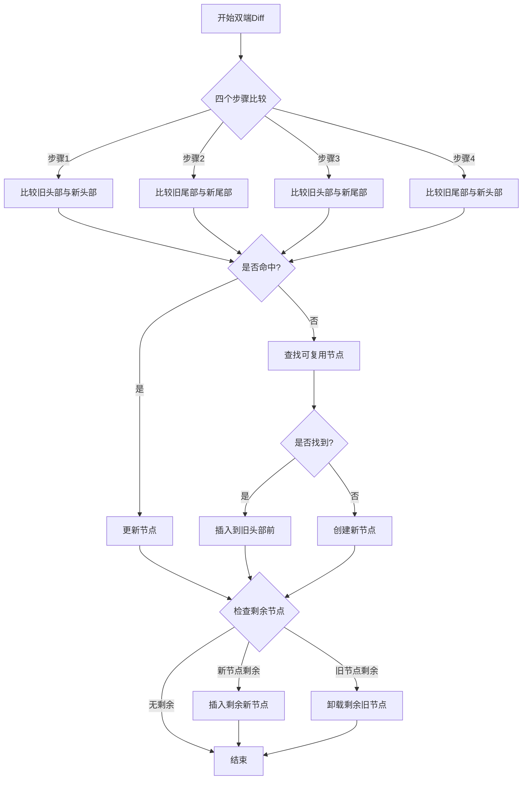

## 双端 diff 算法

双端diff算法通过同时比较新旧节点的两端,来最大程度地复用DOM节点,减少DOM操作

相比简单diff算法,能更好地处理节点位置改变的情况

### 图示

### 核心：四个步骤
1. 比较旧头部节点与新头部节点 // 处理节点保持在头部的情况
2. 比较旧尾部节点与新尾部节点 // 处理节点保持在尾部的情况  
3. 比较旧头部节点与新尾部节点 // 处理节点从头部移动到尾部的情况
4. 比较旧尾部节点与新头部节点 // 处理节点从尾部移动到头部的情况
   
### 非理想情况

#### 1. 四个步骤都未命中
- 拿新头部节点在旧节点中找可以复用的节点
   - 找到后将其插入旧头部节点前面,并将原位置置undefined以避免重复处理
   - 找不到则说明是全新节点,在旧头部节点前面创建新节点

#### 2. 新节点剩余处理
- 通过diff后的索引判断,diff后新节点还有剩余
- 将剩余新节点按顺序插入到旧节点前面
- 这种情况出现是因为双端diff在处理过程中可能会跳过一些新节点,需要最后统一处理

#### 3. 旧节点剩余处理 
- 通过diff后的索引判断,diff后旧节点还有剩余
- 遍历剩余旧节点并执行卸载操作,释放资源

