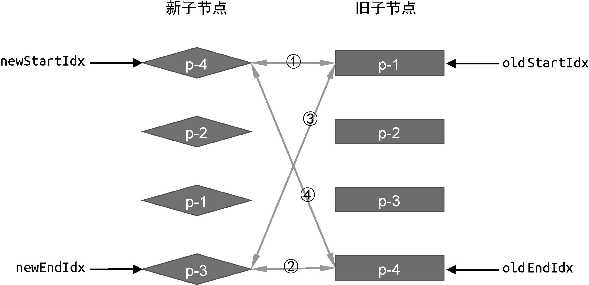

## 双端 diff 算法

### 图示

### 核心: 四个步骤

1. 比较旧头部节点与新头部节点

2. 比较旧尾部节点与新尾部节点

3. 比较旧头部节点与新尾部节点

4. 比较旧尾部节点与新头部节点
   
### 非理想情况

1. 四个步骤都未命中，拿新头部节点在旧节点中找可以复用的节点
  
   - 找到后将其插入旧头部节点前面，并将其置undefined
   - 找不到则在旧节点前面创建新节点
