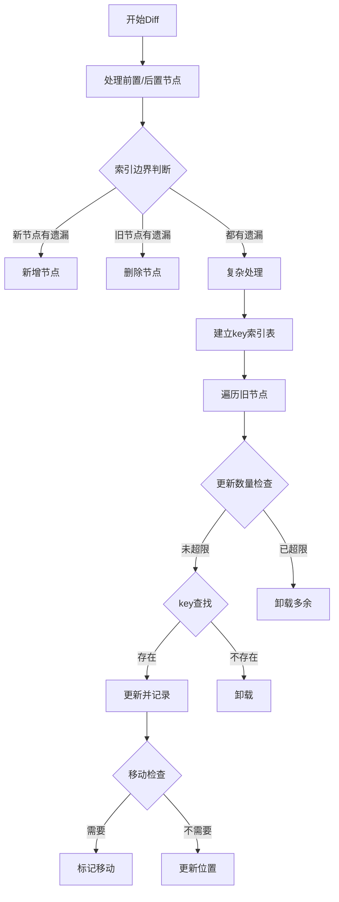

## 快速 Diff 算法

### 核心

1. 先对相同的前置元素和后置元素进行 patch 操作

2. 通过索引j与newEnd、oldEnd判断
   - j > oldEnd && j <= newEnd 则处理新增节点 
   - j > newEnd && j <= oldEnd 则处理删除节点

3. 处理非理想情况(新旧节点都有遗漏)
   1. 构建新节点key索引表 {key: index}
   2. 遍历旧节点组:
      1. 检查更新数量是否超限
         - 未超限: 继续处理
         - 已超限: 卸载多余节点
      2. 在key索引表中查找:
         - 找到: patch节点并记录位置
         - 未找到: 卸载节点
      3. 判断是否需要移动:
         - 需要: moved = true 
         - 不需要: 更新位置标记
  
### 图示

