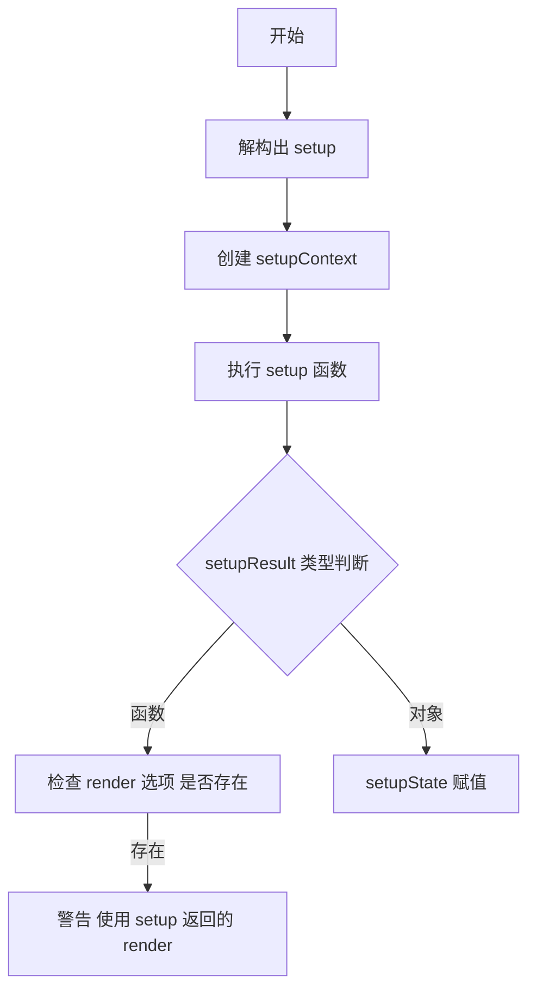

# 12.5 setup 函数的作用与实现

## 作用

Vue.js 3 新增的组件选项，用于配合组合式 API 一起使用。

在组件的生命周期中，setup 函数只在被挂载时执行一次。

## 种类

### 返回 render 函数

返回 render 函数的情况下，组件自身的 render 函数会被忽略。

```js
const Comp = {
  setup() {
    return () =>{
      return {
        type:'div',
        children: 'hello',
      }
    }
  }
}
```

### 返回对象 对象数据暴露给模版使用

组件的渲染函数中可以通过 this 访问到 setup 暴露出的数据和方法。 

```js
const Comp = {
  setup() {
    const count = ref(0)
    return {
      count,
    }，
    render() {
      return {type:'div', children: this.count}
    }
  }
}
```

## API

setup 函数接受两个参数：

1. props 对象，包含组件的属性值
2. setupContext 对象，包含组件的数据和方法

## 渲染器支持

### 图示



### 代码实现

```js
const { render, data, props: propsOption, setup /** 省略 */} = componentOptions

/** 省略 */

const setupContext = { attrs }

const setupResult = setup(shallowReadonly(instance.props), setupContext)

let setupState = null

if (typeof setupResult === 'function') {
  if (render) console.error('setup 函数返回渲染函数，render 选项将被忽略')
  render = setupResult
} else {
  setupState = setupResult
}
```
